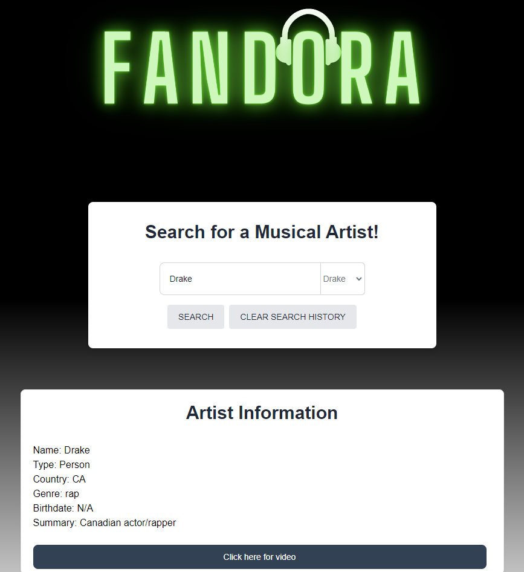

# Fandora

Fandora is a web application that allows users to search for musical artists and retrieve information about them along with their most popular music videos.

## Features

- Search for a musical artist and retrieve their information
- Display the most popular music video for the artist
- Save and retrieve previously searched artists
- Clear the search history

## Technologies Used

- HTML
- CSS
- JavaScript
- Tailwind

## Installation

1. Clone the repository: https://github.com/keybit-1/Fandora.git

2. Open the project in your preferred code editor.

3. Open the `index.html` file in your web browser.

You can also acess the deployed application here: https://keybit-1.github.io/Fandora/

## Usage

1. Enter the name of a musical artist in the search input field.

2. Click the "Search" button to retrieve information about the artist and their most popular music video.

3. The artist information will be displayed in the "Artist Information" section, and the music video link will be available in the "Click here for video" button.

4. You can also select a previously searched artist from the dropdown list to retrieve their information.

5. To clear the search history, click the "Clear Search History" button.

## Customization

- To customize the styling, you can modify the CSS code in the `style.css` file.

- To change the API keys used for MusicBrainz and YouTube, replace the placeholders in the JavaScript code in the `script.js` file.

## Contributing

Contributions are welcome! If you find any issues or would like to add new features, please submit an issue or a pull request.

## License

This project is licensed under the [MIT License](LICENSE).

---

For any questions or inquiries, please contact us at fandora.site@gmail.com.

